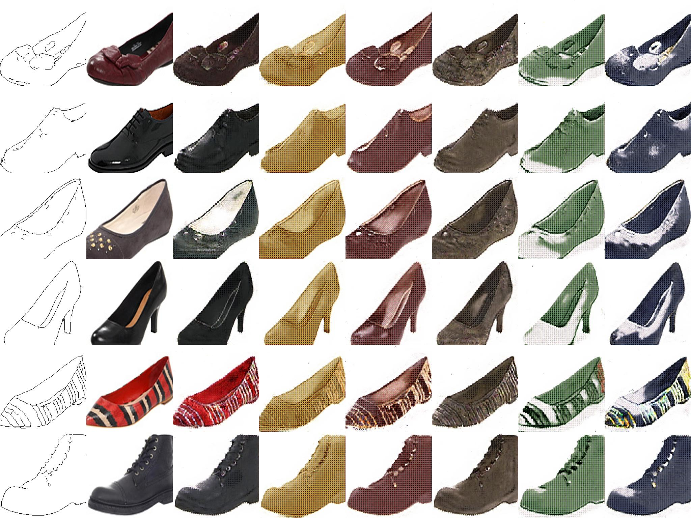
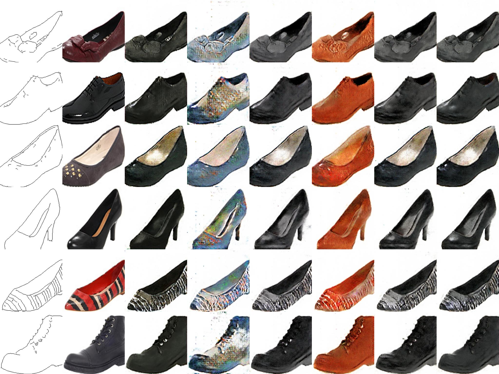

# chainer-bicyclegan

Chainer implementation of ["Toward Multimodal Image-to-Image Translation"](https://arxiv.org/abs/1711.11586).  
This is a faithful re-implementation of [the official PyTorch implementation](https://github.com/junyanz/BicycleGAN).


## Installation

```bash
git clone --recursive https://github.com/wkentaro/chainer-bicyclegan.git
cd chainer-bicyclegan

conda install -c menpo -y opencv
pip install .
```


## Training

```bash
cd examples/bicyclegan

# ./train.py <dataset> --gpu <gpu_id>
./train.py edges2shoes --gpu 0
```

## Results

It shows that the BicycleGAN output has more variety with smaller batchsize.

### edges2shoes

- batchsize=2,epoch=60 (left)
- batchsize=60,epoch=60 (right)

 

### edges2handbags

- batchsize=2,epoch=5 (left)
- batchsize=60,epoch=15 (right)

 
